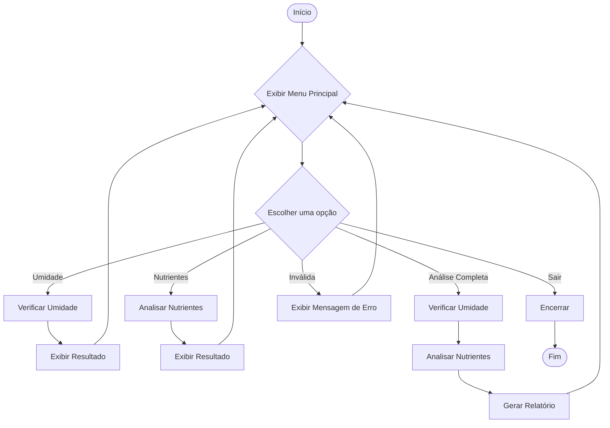

# 🌱 AgroSolo Tech — Agricultura de Precisão com Python

> Protótipo de um software de linha de comando para análise e manejo de solo, desenvolvido como uma ferramenta de apoio à decisão na Agricultura 4.0.

---

## 📚 Tabela de Conteúdos

- [📌 Sobre o Projeto](#-sobre-o-projeto)
- [✨ Funcionalidades](#-funcionalidades)
- [🛠️ Tecnologias Utilizadas](#-tecnologias-utilizadas)
- [🚀 Como Executar o Projeto](#-como-executar-o-projeto)
- [📁 Estrutura do Código](#-estrutura-do-código)
- [🧭 Fluxograma da Aplicação](#-fluxograma-da-aplicação)
- [👤 Autor](#-autor)

---

## 📌 Sobre o Projeto

O **AgroSolo Tech** é um protótipo de software de terminal desenvolvido em **Python**, projetado para atuar como uma ferramenta de apoio à decisão no manejo de solo na agricultura de precisão.

Concebido a partir dos conceitos de automação e **Agricultura 4.0**, com base em materiais da **Embrapa** e do **Sebrae**, o sistema realiza diagnósticos rápidos sobre a saúde do solo, focando em dois parâmetros principais:

- **Umidade**
- **Níveis de Nitrogênio**

Com base nos diagnósticos, o software gera recomendações imediatas de ações corretivas (como irrigação ou adubação), promovendo a **eficiência** e **sustentabilidade** da produção agrícola.

---

## ✨ Funcionalidades

- ✅ **Menu Interativo:** Interface CLI clara e intuitiva.
- ✅ **Análises Modulares:** Execute análises de umidade e nutrientes separadamente.
- ✅ **Análise Integrada:** Execute todas as análises em sequência.
- ✅ **Validação de Entradas:** Prevenção contra entradas inválidas.
- ✅ **Geração de Relatórios:** Diagnóstico completo e recomendações práticas.
- ✅ **Simulação de Ações:** Simulação de salvamento ou envio do relatório.

---

## 🛠️ Tecnologias Utilizadas

- [Python 3](https://www.python.org/)

---

## 🚀 Como Executar o Projeto

### ✅ Pré-requisitos

- Ter o **Python 3** instalado em sua máquina.

### ▶️ Passos

Clone o repositório:

```bash
git clone https://github.com/TMCatz/projeto-agricultura-precisao.git
```

Acesse o diretório do projeto:

```bash
cd projeto-agricultura-precisao
```

Execute o script principal:

```bash
python "AgroSolo Tech.py"
```

Siga as instruções no terminal para interagir com o menu.

---

## 📁 Estrutura do Código

Apesar de estar em um único script `.py`, o código é modularizado para facilitar o entendimento e a manutenção.

- `main()` → Controla o menu e o fluxo do programa.
- `verificar_umidade_solo()` → Analisa e retorna os dados de umidade.
- `analisar_nutrientes()` → Analisa e retorna os dados de nitrogênio.
- `gerar_relatorio_simples()` → Consolida os resultados e gera o diagnóstico final.

---

## 🧭 Fluxograma da Aplicação

Diagrama de fluxo simplificado da aplicação (em sintaxe Mermaid):



> 💡 Se quiser gerar uma imagem do fluxograma, use um renderizador Mermaid online ou plugins no VS Code ou GitHub (algumas versões do GitHub já renderizam automaticamente).

---

## 👤 Autor

Desenvolvido por **Nathan Moratelli**  
🔗 [GitHub](https://github.com/TMCatz)
